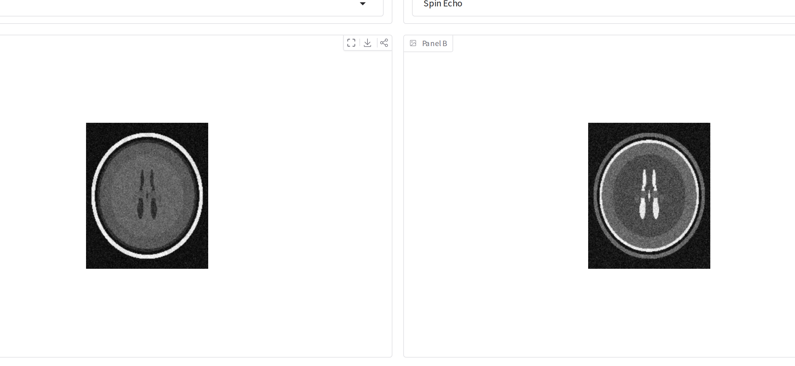
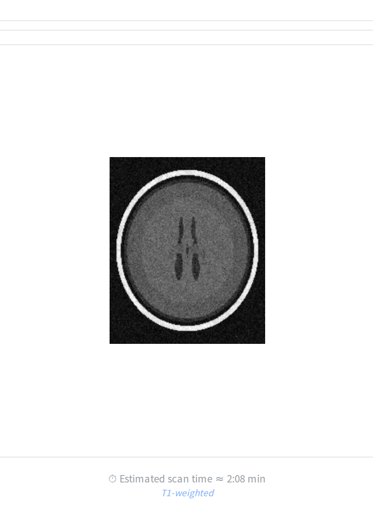
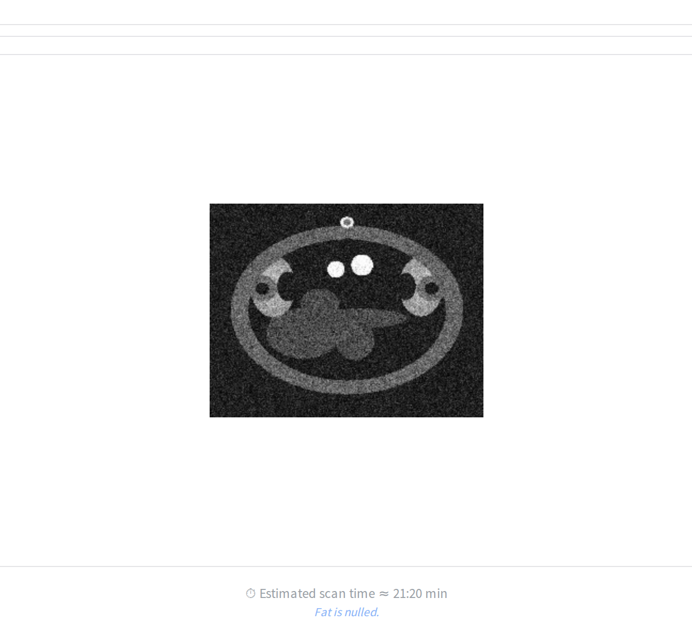
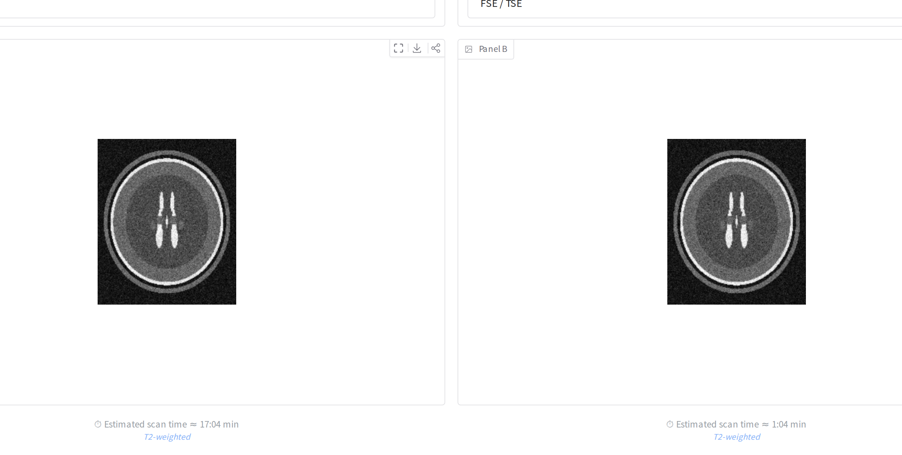

# MRI Simulator

An open-source MRI physics simulator for radiology residents and medical
students — change the scan parameters and watch the image respond in real time,
right in your browser, with nothing to install.

## ▶️ Try it now

**[Launch the live simulator →](https://ea1188-mri-simulator.hf.space)**

[](https://huggingface.co/spaces/ea1188/mri-simulator)

No account, no setup — it runs on free hardware and loads in a normal browser
tab (works on a tablet). Pick a **guided lesson** to be walked through one idea,
or use **Free Explore** to drive every control yourself.

## See it in action

<p align="center">
  <br>
  <em><b>Compare mode</b> — the same brain rendered as <b>T1-weighted</b> (left:
  short TR/TE) and <b>T2-weighted</b> (right: long TR/TE). Watch the CSF in the
  ventricles flip from dark to bright: that is the essence of T1 vs T2 contrast.</em>
</p>

<table>
<tr>
<td width="50%" valign="top">
  <br>
  <em>The basic view: one image, live parameters, and an always-on caption
  showing the estimated scan time and the current weighting.</em>
</td>
<td width="50%" valign="top">
  <br>
  <em><b>Nulling fat with STIR</b> — slide the inversion time to the fat null and
  the simulator confirms it on-screen: <b>“Fat is nulled.”</b></em>
</td>
</tr>
</table>

<p align="center">
  <br>
  <em><b>SE vs FSE</b> — identical T2-weighted contrast, but conventional spin
  echo (left) takes about sixteen times longer than fast spin echo (right):
  <b>17:04</b> vs <b>1:04</b>. This is why FSE replaced SE for routine T2 imaging.</em>
</p>

## What you can learn

Three short, guided lessons, each built around a single idea:

- **What TR does** — how repetition time trades T1 weighting for
  proton-density weighting, and why gray–white contrast flattens as TR lengthens.
- **Nulling fat with STIR** — how the inversion time can suppress fat entirely,
  and why that null shifts when you switch between 1.5 T and 3 T.
- **SE vs FSE** — why fast spin echo replaced conventional spin echo for routine
  T2-weighted imaging: the same contrast, roughly sixteen times faster.

Live annotations narrate the physics as you go — “Fat is nulled.”, “Fluid is
nulled.”, “T1-weighted” — appearing only when the parameters make them
unambiguously true.

---

## Under the hood

Everything below is for contributors and researchers. The interactive apps are a
thin layer over a tested, importable physics library in `src/`; the web app
above is a focused, learner-facing subset of it.

This repository has three front-ends:

- **`app.py`** (repo root) — the **Gradio web app** that powers the live Space
  above. Guided lessons, side-by-side compare, and live annotations over the
  validated engine. Run with `python app.py`.
- **`src/app_qt.py`** — the full **desktop app** (PyQt6) exposing every feature
  listed below. Run with `python src/app_qt.py`.
- **`src/app.py`** / `src/simulate.py` — an earlier matplotlib/Tkinter
  **prototype**, retained for reference only and missing most of the above.

The PyQt6 desktop app drives the physics engine in real time:

- **Sequences** — Spin Echo, FSE/TSE (EPG echo train), Gradient Echo, Inversion Recovery, Diffusion (DWI with ADC/FA maps), MR Angiography (TOF / Phase Contrast), fMRI BOLD, and Quantitative (qMRI) parameter mapping
- **qMRI maps** — T1 (variable flip angle), T2 and T2\* (multi-echo), and Synthetic SE contrast rendered from the maps
- **Contrast & field strength** — measured 1.5T / 3T tissue tables, Gadolinium dosing, magnetization transfer, B1+ inhomogeneity, and automatic fat-water in-/opposed-phase (India-ink) for gradient echo
- **Acquisition** — matrix, FOV, bandwidth, NEX, partial Fourier, k-space apodisation, and parallel imaging (SENSE / GRAPPA / compressed sensing)
- **Artifacts** — motion ghosting, chemical shift, susceptibility dropout, zipper
- **Analysis & display** — signal/contrast curves, image histogram, live k-space, pulse-sequence diagrams, tissue-label overlays, multi-slice grids, graphic FOV/slice planning, clinical protocol presets, and SNR / CNR / SAR / scan-time metrics

## Physics library

All physics lives in tested, importable modules under `src/`; the GUI is a layer over them. Items tagged **(library-only)** are fully usable from Python and covered by tests, but are not yet wired into the GUI.

### Signal physics
- **Spin Echo, Gradient Echo, Inversion Recovery** — closed-form signal equations with T1/T2/PD weighting
- **Fast Spin Echo (FSE/TSE)** — full Extended Phase Graph (EPG) echo-train simulation; handles stimulated echoes and variable flip angles
- **fMRI BOLD** — T2\* modulation via neurovascular coupling, block-design t-statistic maps
- **Diffusion (DWI/DTI)** — mono-exponential and tensor-based signal, ADC/FA maps
- **MR Angiography** — Time-of-Flight inflow enhancement, Phase Contrast velocity encoding

### Advanced contrast
- **Quantitative MRI** — VFA T1 mapping (Fram linearisation), multi-echo T2/T2\* log-linear fitting, IR T1 curve fitting, synthetic contrast generation
- **Dixon fat-water** — two-point (magnitude) and three-point (B0-corrected complex) separation with fat-fraction maps; STIR fat suppression
- **Magnetization Transfer (MT)** — two-pool binary spin-bath model (Henkelman 1993); MTR maps and Z-spectra
- **B1+ inhomogeneity** — Gaussian and sinusoidal transmit field maps; double-angle and AFI B1 mapping sequences

### K-space and acquisition
- **K-space pipeline** — FFT/IFFT, matrix cropping, zero-fill interpolation, Hamming/Hanning/Blackman apodisation, partial Fourier
- **EPI** *(library-only)* — alternating-readout trajectory, Nyquist (N/2) ghosting, B0 phase-encode distortion, T2\* blurring, phase correction
- **Parallel imaging** — full Cartesian SENSE unfolding (physics-correct g-factor), approximate GRAPPA, variable-density compressed sensing

### Field and hardware effects
- **B0 field maps** *(library-only)* — dipole convolution from susceptibility labels, polynomial shim residuals, Gaussian localised distortions
- **Coil sensitivity** *(library-only)* — head-array simulation, sum-of-squares combination, g-factor maps
- **Rician noise** — correct magnitude-image noise model, SNR estimation, bias correction
- **Partial volume effects** *(library-only)* — sub-voxel tissue mixing

### Geometry and anatomy
- **Oblique slices** — double-oblique prescription, multi-slice slabs, anisotropic voxel spacing
- **Scan geometry** — FOV, matrix, resolution, phase-encode direction, 3-plane localizer overlays
- **Real segmented anatomy** *(library-only)* — load TotalSegmentator NIfTI masks via `nifti_region.py` (remapping the segmentation's classes to the tissue tables) to drive the simulator from a real human volume instead of the synthetic phantoms
- **Artifacts** — motion ghosting, chemical shift displacement, susceptibility signal loss, zipper
- **Pulse sequence diagrams** — SE, GRE, IR, FSE, EPI, DWI, GRE-EPI renderers
- **Export** — PNG/PDF report export; DICOM export *(library-only)*

## Installation

```bash
git clone https://github.com/ea1188/mrisim.git
cd mrisim
pip install -r requirements.txt
```

Python 3.11+ is required (uses `X | Y` union type syntax). No external datasets are needed: when no BrainWeb/atlas cache is present, a synthetic brain (and synthetic body regions) is generated automatically on first run.

## Running tests

[](https://github.com/ea1188/mrisim/actions/workflows/ci.yml)

```bash
python -m pytest tests/
```

The full suite runs in CI on every push and pull request to `main` (the badge
above reflects its current state). As of May 2026 it is **1706 passing, 40
skipped**; run the command above to see the live count for yourself. Line
coverage is reported by the CI coverage step.

## Project layout

```
app.py                # Gradio web app (the live Space; guided lessons + compare)
lessons.py            # guided-lesson content (data only)
annotations.py        # real-time on-image teaching annotations
src/                  # all physics + the desktop GUI (plain imports by bare name)
  app_qt.py           # PyQt6 interactive desktop GUI
  rendering.py        # Qt-free signal-rendering helpers (tested)
  signal_engine.py    # SE / GRE / IR signal equations, SNR, scan time
  simulator.py        # Qt-free acquisition engine driven by the web app
  simulate.py         # thin orchestration layer (legacy prototype)
  phantom.py          # 2-D brain phantom (labels 0–4)
  phantom3d.py        # 3-D synthetic brain (labels 0–5)
  body_phantoms.py    # synthetic abdomen / knee / spine / pelvis
  nifti_region.py     # load real TotalSegmentator NIfTI anatomy
  tissue_db.py        # measured tissue properties at 1.5T and 3T
  kspace.py           # k-space acquisition pipeline
  epi.py              # EPI trajectory and artifacts
  fse.py              # FSE/EPG echo-train simulation
  acceleration.py     # SENSE / GRAPPA / compressed sensing
  coil.py             # coil sensitivity models
  dixon.py            # fat-water separation and STIR
  mt.py               # magnetization transfer
  b0.py               # B0 field maps and distortion
  b1.py               # B1+ inhomogeneity
  diffusion.py        # DWI / DTI
  fmri.py             # BOLD fMRI
  qmri.py             # quantitative MRI parameter mapping
  rician.py           # Rician noise model
  oblique.py          # oblique slice prescription
  scan_geometry.py    # slice prescription + 3-plane localizer geometry
  artifacts.py        # motion, chemical shift, susceptibility, zipper
  pv.py               # partial volume effects
  angiography.py      # TOF and phase-contrast MRA
  dicom_export.py     # DICOM export
  ...
tests/                # pytest suite (one file per module)
tools/                # developer utilities (e.g. README screenshot capture)
assets/               # README screenshots
data/                 # optional phantom/atlas cache (generated; not in the repo)
```

## Physics references

- Henkelman et al. (1993) *MRM* 29:759 — two-pool MT model  
- Fram et al. (1987) *MRM* 4:306 — VFA T1 linearisation  
- Glover (1991) *J Magn Reson Imaging* 1:521 — three-point Dixon  
- Pruessmann et al. (1999) *MRM* 42:952 — SENSE reconstruction  
- Weigel (2015) *J Magn Reson Imaging* 41:266 — EPG formalism
