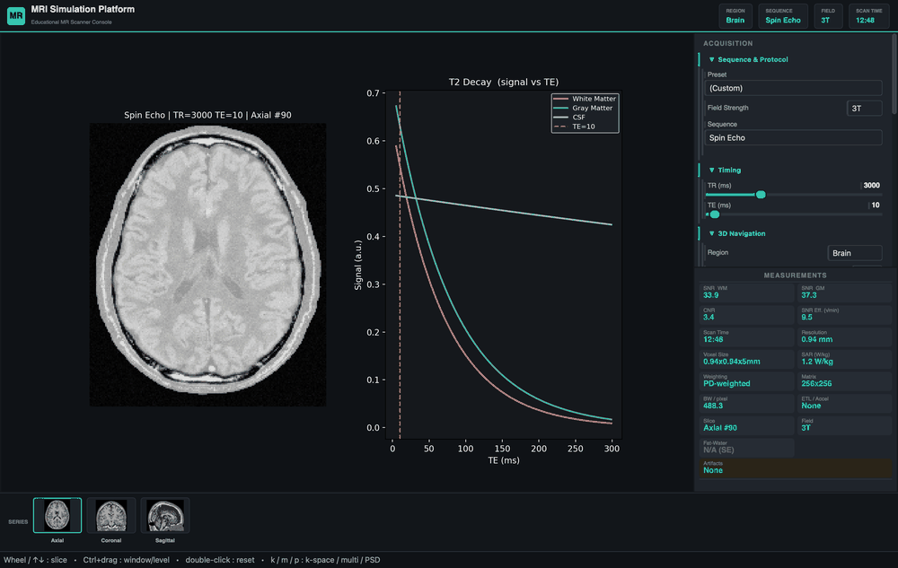
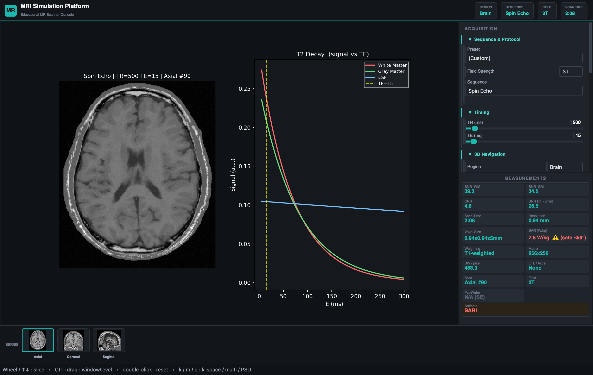
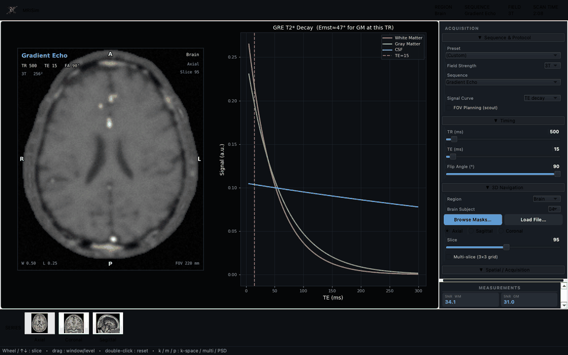
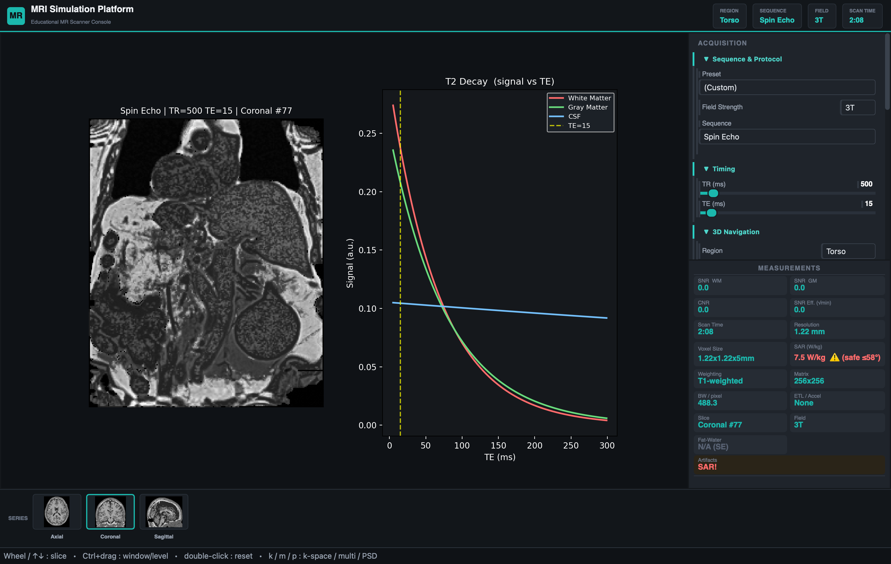

<h1>MRISim</h1>
<p><b>An interactive MRI physics simulator</b> — from tissue &amp; pulse-sequence parameters through k-space to the reconstructed image, in real time.</p>

[](https://github.com/ea1188/mrisim/actions/workflows/ci.yml)
[](https://github.com/ea1188/mrisim/releases/latest)
[](LICENSE)


[](https://ea1188.github.io/mrisim/)
&nbsp;
[](https://github.com/ea1188/mrisim/releases/latest)

</div>

> **▶ [Run MRISim in your browser](https://ea1188.github.io/mrisim/)** — the full physics engine runs client-side via Pyodide, no install. Sequences, contrast, 3D slab acquisition, presets, A/B compare, a 3-plane localizer, and **shareable deep links** (copy a URL to any exact setup) plus PNG download, all live. (First load fetches ~30–50&nbsp;MB; cached afterwards.)
> 
> For the fullest, most robust experience, use the downloadable desktop app.

<p align="center">
  
</p>

<p align="center"><i>Sweeping echo time (TE) at fixed TR — proton-density → T2-weighted contrast, with the marker moving along the live signal decay curve. Every control updates the image in real time.</i></p>

MRISim models the signal chain from tissue properties and pulse-sequence parameters through k-space acquisition to the reconstructed image, covering the major contrast mechanisms and artifacts seen in clinical MRI.

## Interactive simulator

```bash
python src/app_qt.py
```

<p align="center">
  
</p>

The PyQt6 app drives the physics engine in real time:

- **Anatomy** — real BrainWeb brain plus real segmented body regions (Abdomen, Spine, Pelvis, whole Torso) from the TotalSegmentator MRI dataset and a real Knee (KneeBones3Dify), each with a synthetic fallback; load any TotalSegmentator NIfTI mask from disk, or index a folder of masks by body region (see [Anatomy and phantoms](#anatomy-and-phantoms))
- **Sequences** — Spin Echo, FSE/TSE (EPG echo train), Gradient Echo, Inversion Recovery, Balanced SSFP (with off-resonance banding), Echo-Planar (EPI), Diffusion (DWI with ADC/FA maps), MR Angiography (TOF / Phase Contrast), Susceptibility-Weighted Imaging (SWI), fMRI BOLD, and Quantitative (qMRI) parameter mapping
- **qMRI maps** — T1 (variable flip angle), T2 and T2\* (multi-echo), and Synthetic SE contrast rendered from the maps
- **Contrast & field strength** — measured 1.5T / 3T tissue tables, Gadolinium dosing (brain and body, blood-pool weighted), magnetization transfer, B1+ inhomogeneity, flowing-blood signal (spin-echo void / gradient-echo inflow), and three fat-suppression methods (STIR, Dixon in-/opposed-phase, spectral CHESS)
- **Acquisition** — matrix/resolution, FOV (magnify + wraparound when small, surround when large), bandwidth, NEX, partial Fourier, k-space apodisation, parallel imaging (SENSE / GRAPPA / compressed sensing) with g·√R noise, non-Cartesian radial sampling with streaks, and imperfect slice profile + multi-slice cross-talk
- **True 3D (slab) acquisition** — for SE / GRE / IR / bSSFP, excite a slab and phase-encode the slice (kz) direction too, reconstructing a contiguous partition stack with real through-plane resolution, kz partial Fourier, slab-profile edge falloff and the √Nz SNR gain. The slab is acquired **once** and **reformats to any plane** as you change orientation/slice (the viewport flags the acquired plane vs. a reformat); re-acquisition happens only when the prescription changes
- **Artifacts** — motion ghosting (discrete respiratory ghosts), sub-pixel chemical shift, susceptibility dropout, gradient-nonlinearity geometric distortion, zipper
- **Analysis & display** — a switchable signal curve (T2 decay / T1 recovery / TI sweep / contrast map / histogram), live k-space, pulse-sequence diagrams, tissue-label overlays, multi-slice grids, graphic FOV/slice planning, **3D reconstruction as a 2×2 quad (axial/coronal/sagittal reformats + a 3-D MIP overview from the acquired slab; also thick-slab MIP/MinIP/AIP, rotating MIP and oblique reformat)**, clinical protocol presets, and SNR / CNR / SAR / scan-time metrics. The viewport carries DICOM-style corner annotations and anatomical orientation labels (radiological convention) on a dark "scanner-console" display. Scroll the wheel (or arrow keys) to page through contiguous slices a slice-thickness at a time, PACS-style. The control panel collapses into sections with a *find-a-control* search and editable numeric value fields.

<p align="center">
  
</p>

<p align="center"><i>True 3D (slab) acquisition: the slab is acquired once (<code>3D SLAB</code> badge), then rotating to coronal/sagittal <b>reformats</b> the same recon block live — no re-scan — with the viewport flagging the reformat and the acquired plane.</i></p>

> `src/app.py` is an earlier matplotlib/Tkinter prototype, retained only for reference and missing most of the above. Use `app_qt.py`.

## Browser edition — learn MRI with nothing to install

**[ea1188.github.io/mrisim](https://ea1188.github.io/mrisim/)** runs the *real* Python engine entirely in your browser via [Pyodide](https://pyodide.org/) — no install, shareable by link, and it **works offline after the first load**. It's the same physics code as the desktop, with a teaching layer built on top.

**Same simulator, in the browser** — pick a sequence and sweep TR / TE / flip / TI, switch anatomy (brain + the real body atlases, fetched on demand) and orientation, toggle 3D slab acquisition, apply clinical presets, and **compare A/B** side by side. The 3-plane localizer is interactive (drag the FOV box, drag a slice band to angle the plane, click a cross panel to move the slice), and **3D reconstruction opens as a PACS-style 2×2 quad** — axial / coronal / sagittal reformats plus a 3-D MIP overview of the slab.

**A teaching layer for newcomers**

- **Guided lessons** — short, reading-first walkthroughs that set up the scanner and explain what you're seeing, from a beginner *"Start here"* track through the deeper physics.
- **"Learn MRI from scratch" curriculum** — a structured beginner path of modules that build on each other, with your progress saved on the device.
- **Label the anatomy + tissue inspector** — name the structures, and hover any pixel to read which tissue it is and its T1 / T2 / PD.
- **Show the math** — hover a pixel to see the active sequence's signal equation with that tissue's parameters and your TR / TE plugged in, and the resulting pixel value.
- **Contrast map (TR×TE)** — the whole contrast landscape for a tissue pair, with your current protocol marked, so you can see *where* contrast comes from rather than reading one curve.

**Built to be quick to drive** — collapsible control sections with a **"Find a control" search**, **editable numeric values** (type an exact TR / TE or arrow-key it, don't just drag), a **signal curve you can hide or switch** (T2 decay / T1 recovery / inversion / histogram), DICOM-style annotations and PACS-style slice scrolling, and **shareable links** (copy a versioned link to the exact setup). The first visit downloads ~30–50 MB (Pyodide + numpy/scipy/matplotlib + the brain), cached afterwards; body atlases are fetched only when selected.

> The browser edition is a convenience subset for learning and sharing. **For the fullest, most robust experience — loading arbitrary NIfTI, DICOM export, the complete planning workflow and faster rendering — the [desktop app](https://github.com/ea1188/mrisim/releases/latest) is the reference.**

## Anatomy and phantoms

The engine renders any labelled tissue volume under any sequence. Three sources are available, all sharing the `tissue_db` label vocabulary:

- **Brain (real)** — a BrainWeb digital phantom remapped to gray/white matter, CSF, skull, muscle, blood, marrow and dura, with synthetic skull-base air sinuses for realistic susceptibility/EPI behaviour. **Bundled in the repo** (`data/brainweb_sub04_anat.npy`), so the brain works out-of-the-box; falls back to a synthetic brain only if the file is removed.
- **Body (real)** — Abdomen, Pelvis and whole-Torso regions built from the **TotalSegmentator MRI dataset** (publicly available on Zenodo). Per-subject organ masks are combined, the subcutaneous-fat / muscle-wall envelope is filled from the real MRI intensity, and a real-MRI texture field modulates the per-label signal so organs show genuine parenchymal detail rather than flat fills. Volumes are resampled to isotropic so axial/coronal/sagittal reformats stay crisp. The processed caches are **bundled in the repo and in the downloadable binaries**, so they render with no dataset download.
  - https://zenodo.org/records/14710732
- **Spine (real)** — a sagittal lumbar T2 study from the **SPIDER** dataset (van der Graaf et al., [Zenodo](https://zenodo.org/records/10159290), CC-BY-4.0), with the vertebrae (cortical + marrow), intervertebral discs and the spinal canal (CSF + cord) individually segmented, and the real T2 as texture (`scripts/build_spider_spine.py` → `data/spider_spine/`). A far more accurate lumbar spine than the torso-cropped TotalSegmentator atlas. The 3.7 GB image archive isn't redistributed — the build script pulls one subject's image on demand via HTTP range requests.
- **Knee (real)** — a 3D isotropic T2 knee from the **KneeBones3Dify** dataset (Romano et al., [Zenodo](https://zenodo.org/records/10534328), CC-BY-4.0): bones from the provided masks (cortical + marrow), the menisci / cruciates / tendons as dark fibrocartilage, surrounding tissue classified from the real T2 intensity, and the real intensity as the texture field (`scripts/build_knee_atlas.py` → `data/knee_kb3d/`). TotalSegmentator MRI is torso-only, so the knee comes from this dedicated open dataset.
- **Body (synthetic)** — anatomically placed parametric phantoms (built with the `anatomy` toolkit) are the fallback when no real atlas is present.

<p align="center">
  
</p>

<p align="center"><i>Real whole-torso region (TotalSegmentator MRI, coronal): heart, lungs, liver, spleen, kidneys, spine and ribs rendered with real-MRI texture under a spin-echo sequence.</i></p>

The brain and all five body regions above (Abdomen, Spine, Pelvis, Torso and Knee) work out of the box — their caches are bundled in the repo. To load **other** subjects or rebuild the regions from scratch, make sure `nibabel` is installed (it ships in `requirements.txt`) and place the raw dataset under `data/`:

```
data/TotalsegmentatorMRI_dataset_v200/
  s0246/  s0267/  s0187/  s0250/  ...   # each: mri.nii.gz + segmentations/*.nii.gz
```

The loader auto-detects any `TotalsegmentatorMRI_dataset_v*` release (v1.0, v2.0, …) and caches each region as `.npy` on first load, so subsequent switches are instant. The dataset directory is git-ignored. Default region→subject mapping (chosen for near-isotropic acquisition and full coverage in all three planes) lives in `nifti_region._REGION_TOTALSEG`. You can also:

- **Load File…** — load an arbitrary TotalSegmentator label mask (CT 117-class or MR 50-class, auto-detected) from disk.
- **Browse masks** — index a whole folder of masks, classified by body region, and pick one to render.

## Physics library

All physics lives in tested, importable modules under `src/`; the GUI is a layer over them. Items tagged **(library-only)** are fully usable from Python and covered by tests, but are not yet wired into the GUI.

### Signal physics
- **Spin Echo, Gradient Echo, Inversion Recovery** — closed-form signal equations with T1/T2/PD weighting
- **Fast Spin Echo (FSE/TSE)** — full Extended Phase Graph (EPG) echo-train simulation; handles stimulated echoes and variable flip angles
- **Balanced SSFP (bSSFP/TrueFISP)** — refocused steady state with T2/T1-weighted bright fluid; off-resonance banding nulls at Δf = ±1/2TR
- **Flow** — spin-echo flow void and gradient-echo inflow (time-of-flight) enhancement for moving blood
- **fMRI BOLD** — T2\* modulation via neurovascular coupling, block-design t-statistic maps
- **Diffusion (DWI/DTI)** — mono-exponential and tensor-based signal, ADC/FA maps
- **MR Angiography** — Time-of-Flight inflow enhancement, Phase Contrast velocity encoding
- **Susceptibility-Weighted Imaging (SWI)** — long-TE GRE magnitude × a homodyne-high-passed negative phase mask from the local susceptibility field (paramagnetic venous blood / iron darkened), with a minimum-intensity projection venogram (`swi.py`)

### Advanced contrast
- **Quantitative MRI** — VFA T1 mapping (Fram linearisation), multi-echo T2/T2\* log-linear fitting, IR T1 curve fitting, synthetic contrast generation
- **Dixon fat-water** — two-point (magnitude) and three-point (B0-corrected complex) separation with fat-fraction maps; STIR fat suppression
- **Magnetization Transfer (MT)** — two-pool binary spin-bath model (Henkelman 1993); MTR maps and Z-spectra
- **B1+ inhomogeneity** — Gaussian and sinusoidal transmit field maps; double-angle and AFI B1 mapping sequences

### K-space and acquisition
- **K-space pipeline** — FFT/IFFT, matrix cropping, zero-fill interpolation, Hamming/Hanning/Blackman apodisation, partial Fourier; non-Cartesian radial sampling with streak artifacts
- **3-D slab acquisition** — 3-D FFT slab encode with kz phase-encoding and partial Fourier, super-Gaussian slab-excitation profile, and the √(Nz·NEX) SNR gain; energy-conserving (Parseval). Drives the simulator's acquire-once / reformat-any-plane 3-D mode
- **EPI** — alternating-readout trajectory, Nyquist (N/2) ghosting, B0 phase-encode distortion, T2\* blurring, phase correction
- **Parallel imaging** — full Cartesian SENSE unfolding (physics-correct g-factor), approximate GRAPPA, variable-density compressed sensing

### Field and hardware effects
- **B0 field maps** — dipole convolution from susceptibility labels, polynomial shim residuals, Gaussian localised distortions; shown as an off-resonance field-map overlay in the browser
- **Coil sensitivity** — head-array simulation, sum-of-squares combination, and parallel-imaging g-factor maps (the g-factor map is shown in the browser; explicit receive-coil selection is *library-only*)
- **Rician noise** — correct magnitude-image noise model, SNR estimation, bias correction
- **Partial volume effects** — sub-voxel tissue mixing, exposed as a control in both apps

### Geometry and output
- **Oblique slices** — double-oblique prescription, multi-slice slabs, anisotropic voxel spacing
- **Scan geometry** — FOV, matrix, resolution, phase-encode direction, 3-plane localizer overlays
- **Artifacts** — motion ghosting, sub-pixel chemical shift displacement, susceptibility signal loss (internal air), gradient-nonlinearity geometric distortion, zipper
- **Pulse sequence diagrams** — SE, GRE, IR, FSE, Diffusion, balanced SSFP, EPI, TOF and qMRI renderers, each on a physically-ordered local timeline (excitation → echo → readout) with the correct events per sequence
- **Export** — PNG/PDF report export; DICOM export *(library-only)*

## Installation

### Run in your browser (nothing to install)

The quickest way to try MRISim: **[ea1188.github.io/mrisim](https://ea1188.github.io/mrisim/)** — see [Browser edition](#browser-edition--learn-mri-with-nothing-to-install) above for the guided lessons, curriculum and full feature tour. The real Python engine runs entirely client-side via [Pyodide](https://pyodide.org/) — pick a sequence, sweep TR/TE/flip, switch anatomy and orientation, toggle 3D slab acquisition, apply presets, compare A/B, and plan on the 3-plane localizer, all rendered by the same code as the desktop app. The localizer is interactive: the slice shows as a band of its true thickness (the whole slab in 3-D), and you can drag the FOV box to resize/recentre it, drag the slice band to angle the plane (oblique), and click a cross panel to move the slice. The first visit downloads ~30–50 MB (Pyodide + numpy/scipy/matplotlib + the brain phantom) and is cached afterwards. **The body regions use the same real segmented anatomy as the desktop** — the Abdomen/Spine/Pelvis/Torso *and Knee* atlases are fetched on demand (~10–20 MB each, when you select them). Loading external NIfTI and DICOM export remain desktop-only.

> **For the fullest, most robust experience, use the downloadable desktop app.** The browser edition is newer and a convenience subset — it covers the core interactive simulator (now including interactive FOV planning with oblique), but the desktop build is more complete and battle-tested (multi-slice/gap prescription, NIfTI/DICOM import-export, the full FOV-planning workflow, faster rendering). If something feels limited or slow in the browser, the [desktop download](https://github.com/ea1188/mrisim/releases/latest) is the reference experience.

### Download a ready-to-run app (no Python needed)

Grab the build for your system (these links always serve the [**latest release**](https://github.com/ea1188/mrisim/releases/latest), currently **v1.19.0**):

- **Windows** — download [`MRISim-windows.exe`](https://github.com/ea1188/mrisim/releases/latest/download/MRISim-windows.exe) and double-click it.
- **macOS** — download [`MRISim-macos.zip`](https://github.com/ea1188/mrisim/releases/latest/download/MRISim-macos.zip), unzip it, drag `MRISim.app` to *Applications*, then allow it on first launch (see [macOS — "can't be opened"](#macos--mrisim-cant-be-opened--apple-could-not-verify) below).
- **Linux** — download [`MRISim-linux.tar.gz`](https://github.com/ea1188/mrisim/releases/latest/download/MRISim-linux.tar.gz), extract it, and run `./MRISim` (needs Qt libraries: `sudo apt-get install libxcb-cursor0 libgl1`).

Each download bundles Python, every dependency, the brain phantom **and the five real body regions** (Abdomen, Spine, Pelvis, whole Torso, and the Knee) — a few hundred MB — so there's nothing else to install and real anatomy works offline. The first launch is slower while font caches build; later launches are quick.

> These builds are **unsigned**, so on first launch your OS may warn that the developer is unidentified (macOS Gatekeeper / Windows SmartScreen). That's expected — see below to allow it.

#### macOS — "MRISim can't be opened" / "Apple could not verify…"

macOS blocks unsigned apps on first launch. To allow it:

1. Double-click `MRISim.app` once. You'll get a warning — click **Done** (or Cancel).
2. Open  **System Settings → Privacy & Security**, scroll down to the **Security** section. You'll see a message like *"MRISim.app was blocked to protect your Mac."* Click **Open Anyway**.
3. Confirm with **Open Anyway** again and authenticate (Touch ID / password) if asked.

On older macOS you can instead **right-click (or Control-click) the app → Open → Open**. After you've allowed it once, it opens normally every time.

If it still won't launch, you can clear the quarantine flag in Terminal:

```bash
xattr -dr com.apple.quarantine /Applications/MRISim.app
```

On **Windows**, if SmartScreen appears, click *More info → Run anyway*.

### Quick version (if you're comfortable with a terminal)

Requires **Python 3.11+** (the code uses `X | Y` union type syntax).

```bash
git clone https://github.com/ea1188/mrisim.git
cd mrisim
python3 -m venv .venv && source .venv/bin/activate   # Windows: .venv\Scripts\activate
pip install -r requirements.txt
python src/app_qt.py
```

The BrainWeb brain **and all five body regions** (Abdomen, Spine, Pelvis, Torso and Knee) are bundled in the repo, so the app opens on real anatomy with **no dataset download required**. Only loading *other* subjects or regions needs the raw dataset (see [Anatomy and phantoms](#anatomy-and-phantoms)).

### Step-by-step (no terminal experience needed)

Never used a terminal? Follow these in order — you only do steps 1–5 once.

**Step 1 — Install Python (version 3.11 or newer)**

Go to [python.org/downloads](https://www.python.org/downloads/) and download the latest installer for your system, then run it.
- **Windows:** on the first screen of the installer, **tick the box "Add Python to PATH"** before clicking *Install Now*. This matters — without it the commands below won't be found.
- **macOS:** open the downloaded `.pkg` file and click through the installer.

**Step 2 — Open a terminal**

A "terminal" is a window where you type commands.
- **Windows:** click Start, type `PowerShell`, and press Enter.
- **macOS:** press `Cmd` + `Space`, type `Terminal`, and press Enter.
- **Linux:** press `Ctrl` + `Alt` + `T`.

Check Python is installed by typing this and pressing Enter:
```bash
python3 --version
```
You should see something like `Python 3.12.x`. (On Windows, if `python3` isn't found, try `python --version`.)

**Step 3 — Download MRISim**

The easiest way (no extra tools):
1. Open the [latest release page](https://github.com/ea1188/mrisim/releases/latest).
2. Under **Assets**, click **Source code (zip)** to download it.
3. Find the downloaded `.zip` (usually in your *Downloads* folder) and unzip it. You'll get a folder like `mrisim-1.0.0`. Move it somewhere easy, e.g. your *Desktop*.

**Step 4 — Point the terminal at that folder**

In your terminal, type `cd ` (the letters c, d, then a space — don't press Enter yet), then **drag the unzipped folder from your file explorer onto the terminal window**. The folder's location fills in automatically. Now press Enter. For example:
```bash
cd /Users/yourname/Desktop/mrisim-1.0.0
```

**Step 5 — Set up and install (copy-paste one block for your system)**

macOS / Linux:
```bash
python3 -m venv .venv
source .venv/bin/activate
pip install -r requirements.txt
```

Windows (PowerShell):
```powershell
python -m venv .venv
.venv\Scripts\Activate.ps1
pip install -r requirements.txt
```
This creates a private workspace (`.venv`) and downloads everything MRISim needs. It takes a few minutes the first time. (On Windows, if you get a message about scripts being disabled, run `Set-ExecutionPolicy -Scope CurrentUser RemoteSigned` once, press `Y`, then re-run the activate line.)

**Step 6 — Run the simulator**

```bash
python src/app_qt.py
```
A window opens showing an MRI of a brain. That's it — explore the controls on the side panels.

**Coming back later**

Next time, you only need to open a terminal, `cd` into the folder again (Step 4), re-activate the workspace, and run the app:
```bash
source .venv/bin/activate     # Windows: .venv\Scripts\Activate.ps1
python src/app_qt.py
```

### If something goes wrong

- **`python3: command not found` (or `python`):** Python isn't installed or (on Windows) "Add Python to PATH" wasn't ticked in Step 1. Reinstall Python and try again.
- **`No such file or directory` after `cd`:** the terminal isn't in the project folder. Redo Step 4 (the `cd` + drag trick).
- **`No module named ...` when running the app:** the install step didn't finish or the workspace isn't active. Make sure you ran the Step 5 block and see `(.venv)` at the start of your terminal line, then re-run `pip install -r requirements.txt`.
- **Linux only — `could not load the Qt platform plugin "xcb"`:** install the system graphics libraries the window needs:
  ```bash
  sudo apt-get install libxcb-cursor0 libgl1
  ```
  On a headless server (no screen), run under a virtual display: `xvfb-run python src/app_qt.py`.
- **Optional extras:** `nibabel` (already installed in Step 5) loads real body anatomy; the `brainweb` package is only needed to regenerate the brain or use a different BrainWeb subject.

> **Technical note:** the source modules import each other by bare name, so they expect `src/` on the import path. Running `python src/app_qt.py` handles this automatically (Python puts the script's directory first on `sys.path`), as does the test suite via `tests/conftest.py`. If you import the modules yourself, run from `src/` or set `PYTHONPATH=src`.

## Running tests

From the repository root (`tests/conftest.py` puts `src/` on the path and forces a non-interactive matplotlib backend):

```bash
pytest                  # or: python -m pytest
```

2,000+ tests, all passing. Coverage is ~94% across the non-GUI engine modules and ~87% overall; the PyQt GUI is additionally exercised by a headless smoke-test harness. CI runs `ruff` (lint) and strict `mypy` (type-checking) on every push, and enforces a **coverage floor** so new untested code fails the build.

## Validation

[**`docs/VALIDATION.md`**](docs/VALIDATION.md) is a generated benchmark report that pins the engine's quantitative behaviour to the literature: measured 1.5 T / 3 T tissue relaxation vs published means (Wansapura 1999, Stanisz 2005, de Bazelaire 2004), the contrast/nulling each clinical weighting produces (T1w WM > GM > CSF, T2w CSF > GM > WM, FLAIR/STIR nulls), analytic landmarks (Ernst angle, bSSFP banding null at 1/2TR, fat–water shift at 3.5 ppm·γ·B0), diffusion ADCs, qMRI round-trips, and the **demo pathologies' discriminating features** (acute-infarct restricted diffusion, microhaemorrhage T2\*/susceptibility, the abscess's DWI-bright core vs. a tumour's facilitated core — Schaefer 2000, Haacke 2009, Ebisu 1996). Every row carries a PASS/FAIL tolerance, and `tests/test_validation_report.py` fails if any check regresses — so the report can't drift from the physics. Regenerate with `python scripts/validation_report.py`.

## Project layout

```
src/                  # all source modules (plain imports by bare name)
  app_qt.py           # PyQt6 interactive GUI
  simulator.py        # core engine — Simulator.simulate(params) -> (image, metrics)
  web_adapter.py      # Qt-free orchestration for the Pyodide browser build
  rendering.py        # Qt-free signal-rendering helpers (tested)
  signal_engine.py    # SE / GRE / IR signal equations, SNR, scan time
  simulate.py         # thin orchestration layer
  phantom.py          # 2-D brain phantom (labels 0–4)
  phantom3d.py        # 3-D synthetic brain (labels 0–5)
  body_phantoms.py    # body region registry + synthetic abdomen/knee/spine/pelvis
  nifti_region.py     # load real TotalSegmentator MRI anatomy (masks + texture)
  region_index.py     # classify/index a folder of NIfTI masks by body region
  brainweb_loader.py  # load + remap the real BrainWeb brain phantom
  tissue_db.py        # measured tissue properties at 1.5T and 3T
  kspace.py           # k-space acquisition pipeline
  acquisition3d.py    # true 3-D slab acquisition (kz encode, reformat)
  swi.py              # susceptibility-weighted imaging (phase mask, mIP)
  epi.py              # EPI trajectory and artifacts
  fse.py              # FSE/EPG echo-train simulation
  acceleration.py     # SENSE / GRAPPA / compressed sensing
  coil.py             # coil sensitivity models
  dixon.py            # fat-water separation and STIR
  mt.py               # magnetization transfer
  b0.py               # B0 field maps and distortion
  b1.py               # B1+ inhomogeneity
  diffusion.py        # DWI / DTI
  fmri.py             # BOLD fMRI
  qmri.py             # quantitative MRI parameter mapping
  rician.py           # Rician noise model
  oblique.py          # oblique slice prescription
  scan_geometry.py    # slice prescription + 3-plane localizer geometry
  artifacts.py        # motion, chemical shift, susceptibility, distortion, zipper
  flow.py             # flowing-blood signal (SE void / GRE inflow)
  pv.py               # partial volume effects
  angiography.py      # TOF and phase-contrast MRA
  dicom_export.py     # DICOM export
  version.py          # single-source __version__
  ...
tests/                # pytest suite (one file per module)
data/                 # phantom/atlas cache + optional TotalSegMRI dataset (git-ignored)
```

See [`CHANGELOG.md`](CHANGELOG.md) for the release history and versioning policy.

## Physics references

- Henkelman et al. (1993) *MRM* 29:759 — two-pool MT model  
- Fram et al. (1987) *MRM* 4:306 — VFA T1 linearisation  
- Glover (1991) *J Magn Reson Imaging* 1:521 — three-point Dixon  
- Pruessmann et al. (1999) *MRM* 42:952 — SENSE reconstruction  
- Weigel (2015) *J Magn Reson Imaging* 41:266 — EPG formalism
